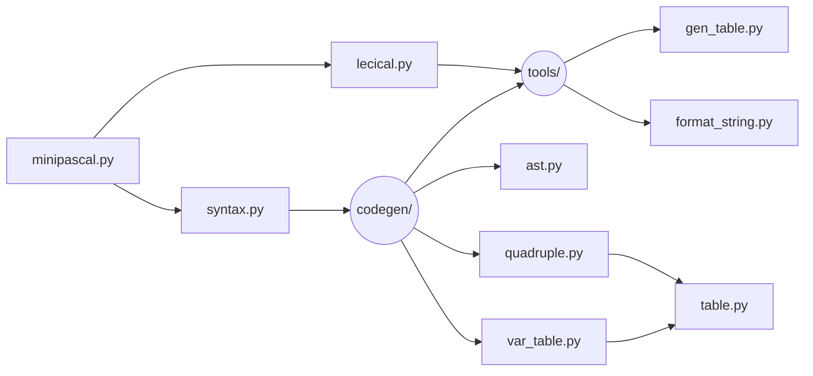

## 程序结构关系

```mermaid
graph LR
    A[minipascal.py]-->B[lecical.py]-->D((tools/))
    A-->C[syntax.py]-->G((codegen/))
    D-->E[gen_table.py]
    D-->F[format_string.py]
    G-->H[ast.py]
    J[table.py]
    G-->I[quadruple.py]-->J
    G-->K[var_table.py]-->J
    G-->D
```
