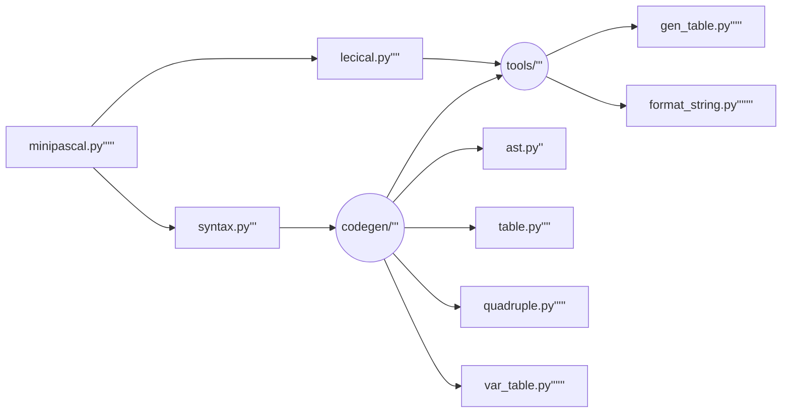

## 程序结构关系

```mermaid
graph LR
    A[minipascal.py''''']-->B[lecical.py'''']-->D((tools/'''))
    A-->C[syntax.py''']-->G((codegen/'''))
    D-->E[gen_table.py''''']
    D-->F[format_string.py''''''']
    G-->H[ast.py'']
    G-->J[table.py'''']
    G-->I[quadruple.py''''']
    G-->K[var_table.py'''''']
    G-->D
```
